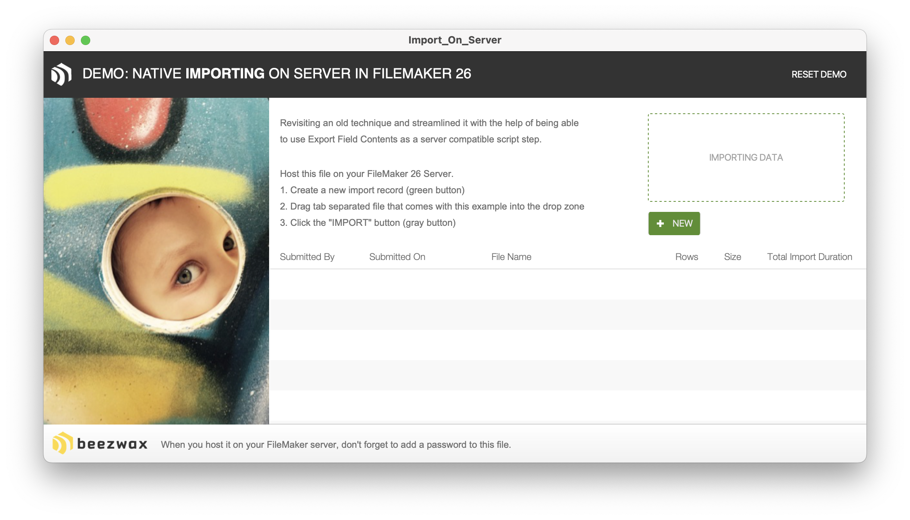

# import_on_server

This example explores how to perform imports on server. We basically took the blog post on this topic ["Imports without tariffs. Nativly, with FileMaker Server"](https://blog.beezwax.net/imports-without-tariffs-natively-with-filemaker-server/) from many years ago and improved upon it.

## Access
The credentials to access this file are. Note the account name is "admin" but the password is empty (no password). You will be asked to set a password when you open the file.

Account: admin
Password: 

## The Example file
Open the file, and set up the credentials for it. Then host it on FileMaker Server 26. Follow the onscreen prompts to import from the Small_Sales_Records.csv. Note the original example import file had over 600k records in it. But it was too large so I made a smaller example file. It is now only 100k.

